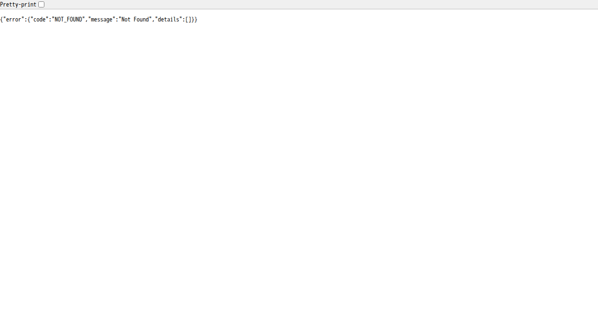

# ☕ Cafe Menu Recommendation System



> 현재는 **MVP UI + FastAPI 백엔드** 구조입니다. (추후 본격 UI로 확장 예정)

광고성 리뷰를 제외하고, 실제 사용자 리뷰 기반으로 카페별 인기 메뉴를 추천하는 **크롤링 + 데이터 분석 + API 서비스** 프로젝트입니다.

---

## 1. 이 프로젝트는 무엇인가?
카페 메뉴를 고를 때 블로그/리뷰를 직접 다 읽어야 하는 불편을 줄이기 위해,
리뷰 데이터를 수집하고(크롤링), 광고를 걸러낸 뒤, 메뉴 언급 빈도를 분석하여
**신뢰 가능한 인기 메뉴 TOP N**을 추천합니다.

핵심 포인트:
- 광고 리뷰 필터링 포함
- 메뉴 추출 및 빈도 분석
- MongoDB(원본) + MySQL(정제/집계) 분리 저장
- FastAPI 기반 추천 API 제공
- Render 배포 가능한 구조

---

## 2. 시스템 흐름

```text
크롤링 → MongoDB 저장 → 광고 필터링 → 메뉴 추출/빈도 분석 → MySQL 저장 → FastAPI 제공
```

자세한 구조/순서는 아래 문서를 기준으로 고정합니다:
- 구조/개발순서: `docs/PROJECT_STRUCTURE.md`
- DB 명세/ERD: `docs/DB_SPEC.md`
- API 명세: `docs/API_SPEC.md`
- 트렌딩 로직 명세: `docs/TRENDING_SPEC.md`
- SNS 정책 명세: `docs/SOCIAL_DATA_POLICY.md`
- SQL 스키마: `docs/sql/schema.sql`
- 운영 규약(문서 우선 원칙): `docs/WORKING_AGREEMENT.md`

---

## 3. 빠른 시작

```bash
cd /home/xkak9/projects/cafe-menu-recommendation-system
python3 -m venv .venv
source .venv/bin/activate
pip install -r requirements.txt
cp .env.example .env
```

`.env`에 실제 접속정보를 입력한 뒤 실행:

```bash
# 테스트
pytest -q

# MySQL 스키마 초기화
PYTHONPATH=. python scripts/init_mysql.py

# 파이프라인 실행 (STEP1~STEP5)
PYTHONPATH=. python scripts/run_pipeline.py --step all --url "https://ko.wikipedia.org/wiki/이디야커피" --cafe "이디야"

# API 실행
uvicorn app.main:app --host 0.0.0.0 --port 8000 --reload
```

---

## 4. 현재 구현 상태
- [x] 프로젝트 구조 생성
- [x] STEP1~STEP5 기본 골격 코드 생성
- [x] 블로그 본문 추출 고도화(네이버 모바일 URL 정규화/셀렉터 확장)
- [x] MongoDB 저장 검증 완료
- [x] MySQL 스키마 초기화 스크립트 및 적재 로직 구현
- [x] 광고 필터 키워드 확장 및 테스트 강화
- [x] 메뉴 사전/별칭 정규화 도입
- [x] 테스트 코드 작성 및 통과(현재 12 passed)
- [x] 카페별 실제 리뷰 URL 다건 수집 파이프라인화 (`--urls-file`, `--query`)
- [x] 카페명/소스별 수집 성능 로그 + 광고/비광고 건수 로그 저장(JSONL/JSON)
- [ ] 메뉴 사전 자동 후보 추출 및 검수 플로우
- [ ] Render 배포 설정

---

## 5. 개발 원칙 (고정)
1. 모든 코드에 한국어 주석 작성
2. 함수마다 역할 설명 필수
3. 민감정보는 `.env`로만 관리
4. 기능 구현 후 테스트/검증 완료 후 다음 단계 진행
5. 구조 변경 전 `docs/*.md` 명세 먼저 갱신

---

## 6. 다음 작업 우선순위 (바로 실행용)
1. 카페별 메뉴 사전 보강 + 후보 자동추출(`menu_candidate`) 연결
2. API를 MySQL 집계 조회 중심으로 전환
3. `mode=popular|trending` 점수/정렬 규칙 명확화
4. 오류 응답(400/404/500) 일관화
5. Render 배포 설정(`render.yaml`) 및 배포 검증

---

## 7. 문서 우선 운영
앞으로 구현/수정은 **반드시 docs의 고정 명세를 기준**으로 진행합니다.
- 명세 변경 필요 시: 코드보다 문서 먼저 변경
- 코드와 문서 불일치 시: 문서 이슈로 기록 후 즉시 정합화

즉, 이 프로젝트의 기준점은 항상 `docs/`입니다.
